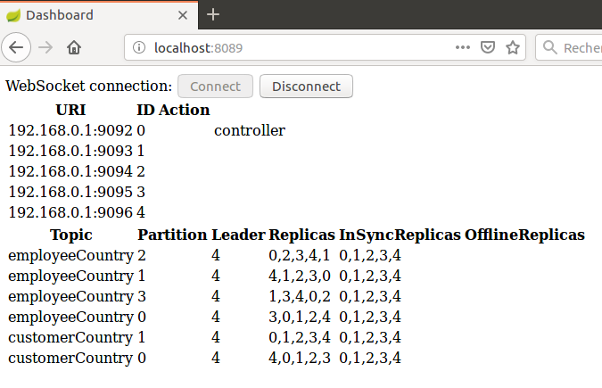

# tiergarten-castle
I present here a demo of a basic Kafka dashboard. It uses Zookeeper commands.

Here are the prerequisites for running the complete application:

A recent Linux version (I used Ubuntu 16.04)

A recent Apache Maven version installed (I used 3.3.9)

A recent Zookeeper version installed (I used 3.4.8-1--1)

A recent Kafka version installed (I used 2.11-1.1.0)

# 1. Create Kafka server.properties files

In folder _yourKafkaInstallationFolder_/config make 4 copies of the file server.properties named:

  server-1.properties
  server-2.properties
  server-3.properties
  server-4.properties

In each file edit the 3 lines:
```
broker.id=0
...
listeners=PLAINTEXT://192.168.0.1:9092
...
log.dirs=/tmp/kafka-logs
```

In file server-1.properties it should be:
```
broker.id=1
...
listeners=PLAINTEXT://192.168.0.1:9093
...
log.dirs=/tmp/kafka-logs-1
```

and so on.

# 2. Create topics

Create two topics named CustomerCountry and EmployeeCountry with the commands:

```
[sudo] _yourKafkaInstallationFolder_/bin/kafka-topics.sh --create --zookeeper localhost:2181 --replication-factor 5 --partitions 2 --topic customerCountry
[sudo] _yourKafkaInstallationFolder_/bin/kafka-topics.sh --create --zookeeper localhost:2181 --replication-factor 5 --partitions 4 --topic employeeCountry
```

Note that one topic has 2 partitions and the other 4 partitions.

# 3. Start the Kafka servers

To start the Kafka servers run the commands:

```
sudo _yourKafkaInstallationFolder_/bin/kafka-server-start.sh _yourKafkaInstallationFolder_/config/server.properties
sudo _yourKafkaInstallationFolder_/bin/kafka-server-start.sh _yourKafkaInstallationFolder_/config/server-1.properties
sudo _yourKafkaInstallationFolder_/bin/kafka-server-start.sh _yourKafkaInstallationFolder_/config/server-2.properties
sudo _yourKafkaInstallationFolder_/bin/kafka-server-start.sh _yourKafkaInstallationFolder_/config/server-3.properties
sudo _yourKafkaInstallationFolder_/bin/kafka-server-start.sh _yourKafkaInstallationFolder_/config/server-4.properties

```

It starts 5 Kafka brokers. The first started (in this case 0) becomes the controller.

# 4 Start cluster-monitor

In folder cluster-monitor run the command:

mvn spring-boot:run

then open a browser and hit the URI localhost:8089 then connect. It will look like this snapshot:



Then kill a non controller broker. The browser should look like this snapshot:


Restart the idle broker. Now the browser should look like this snapshot:


Note that for some partitions the leader changed.

Kill the controller. The browser should look like this snapshot:


A new controller should have been elected.

Restart the idle broker. The browser should look like:


